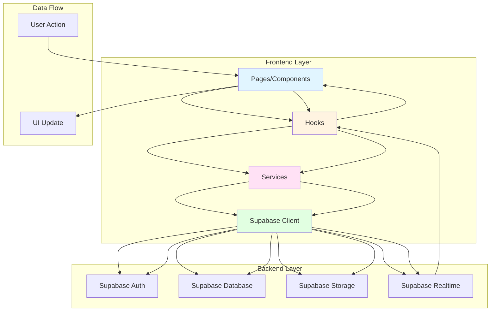

# Yoke - Two-Man Dating App

A React + TypeScript + Supabase web app for duo matching and realtime group chat.

## Features

- ✅ Authentication (email/password)
- ✅ Profile creation
- ✅ Duo creation (pair with friend)
- ✅ Swipe-based matching
- ✅ Realtime chat
- ✅ Match management

## Tech Stack

- **Frontend**: React 18 + TypeScript
- **UI**: shadcn/ui + Tailwind CSS
- **Backend**: Supabase (PostgreSQL + Realtime + Storage)
- **State Management**: React Query (TanStack Query)
- **Routing**: React Router
- **Build Tool**: Vite

## Getting Started

### Prerequisites

- Node.js 18+ and npm
- Supabase account and project

### Installation

1. Clone the repository:
```bash
git clone <your-repo-url>
cd yoke-together-match-together
```

2. Install dependencies:
```bash
npm install
```

3. Create `.env` file:
```bash
cp .env.example .env
```

4. Add your Supabase credentials to `.env`:
```env
VITE_SUPABASE_URL=your_supabase_url
VITE_SUPABASE_PUBLISHABLE_KEY=your_supabase_key
```

5. Apply database schema:
   - Go to Supabase Dashboard → SQL Editor
   - Run the SQL from `supabase/migrations/001_initial_schema.sql`

6. Create storage bucket:
   - Go to Supabase Dashboard → Storage
   - Create a bucket named "photos"
   - Set it to public (or configure RLS policies)

7. Run the development server:
```bash
npm run dev
```

8. Open [http://localhost:5173](http://localhost:5173) in your browser.

## Project Structure

```
src/
├── components/       # Reusable UI components
│   ├── ui/          # shadcn/ui components
│   └── ...          # Custom components
├── hooks/           # Custom React hooks
├── services/        # Service functions for Supabase
├── lib/             # Utility functions
├── pages/           # Page components
├── integrations/    # Supabase client and types
└── assets/          # Static assets
```

## Architecture

- **Components**: Presentational components (pages and UI components)
- **Hooks**: Data fetching and state management (using React Query)
- **Services**: Supabase operations (authentication, database, storage)
- **Lib**: Utility functions (formatting, validation, type guards)

### Data Flow

```
Component → Hook → Service → Supabase
```

- Components use hooks for data
- Hooks use services for operations
- Services use Supabase client for API calls

### Architecture Diagram



### Component Architecture

```
src/
├── components/       # Reusable UI components
│   ├── ui/          # shadcn/ui components
│   └── ...          # Custom components
├── hooks/           # Custom React hooks (React Query)
├── services/        # Service functions (Supabase operations)
├── lib/             # Utility functions
├── pages/           # Page components
└── integrations/    # Supabase client and types
```

### Service Layer Pattern

All data operations follow this pattern:

1. **Service Functions** (`services/*.ts`): Pure functions that interact with Supabase
2. **React Hooks** (`hooks/*.ts`): Wrap services with React Query for caching, loading states, and error handling
3. **Components** (`pages/*.tsx`, `components/*.tsx`): Use hooks to get data and handle user interactions

**Example:**
```typescript
// Service (services/auth.service.ts)
export async function signIn(email: string, password: string) { ... }

// Hook (hooks/useAuth.ts)
export function useSignIn() {
  return useMutation({ mutationFn: signIn });
}

// Component (pages/Auth.tsx)
const signInMutation = useSignIn();
await signInMutation.mutateAsync({ email, password });
```

## Development

### Running the app

```bash
npm run dev
```

### Building for production

```bash
npm run build
```

### Linting

```bash
npm run lint
```

## Database Schema

See `supabase/migrations/001_initial_schema.sql` for the complete database schema.

## Environment Variables

- `VITE_SUPABASE_URL` - Supabase project URL
- `VITE_SUPABASE_PUBLISHABLE_KEY` - Supabase anonymous key

## Documentation

### Essential Docs
- **[API Documentation](./API.md)** - Complete API reference for all service functions
- **[Architecture Documentation](./ARCHITECTURE.md)** - System architecture and design decisions
- **[Product Requirements Document](./PRD.md)** - Complete product requirements and specifications
- **[Setup Instructions](./SETUP_INSTRUCTIONS.md)** - Detailed setup guide
- **[Database Guide](./DATABASE_GUIDE.md)** - Database schema and RLS policies
- **[Troubleshooting Guide](./TROUBLESHOOTING.md)** - Common issues and solutions
- **[Contributing Guide](./CONTRIBUTING.md)** - How to contribute to the project

### Documentation Index
See [docs/INDEX.md](./docs/INDEX.md) for a complete list of all documentation files.

## Contributing

1. Follow the `.cursorrules` guidelines
2. Keep code DRY (Don't Repeat Yourself)
3. Use TypeScript for type safety
4. Use React Query for data fetching
5. Write reusable components and hooks
6. See [API.md](./API.md) for service function documentation
7. See [ARCHITECTURE.md](./ARCHITECTURE.md) for architectural patterns

## License

[Your License Here]
